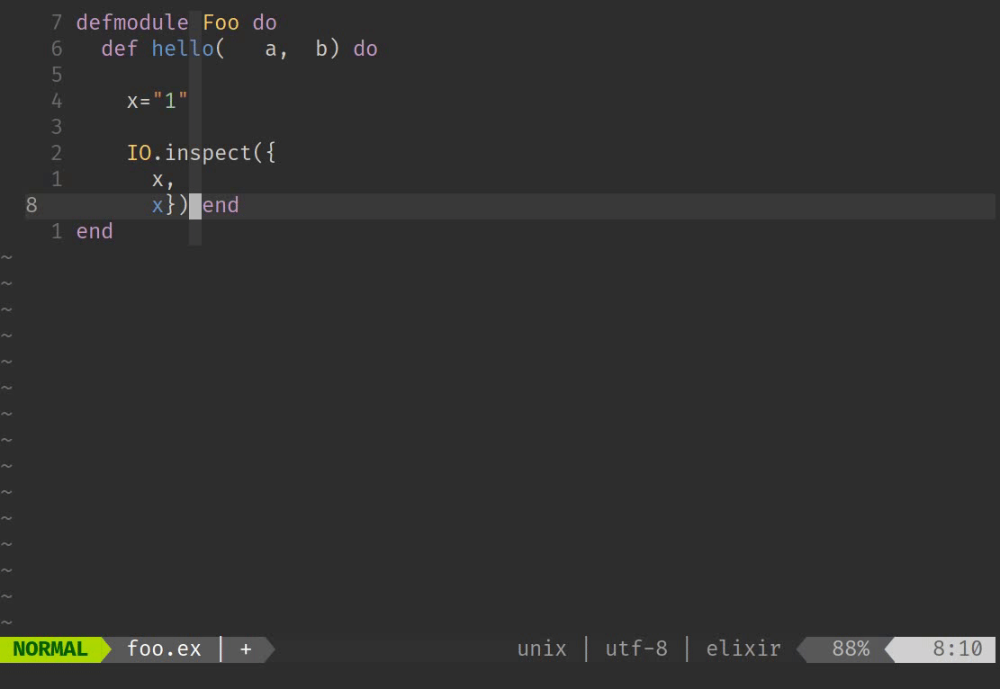
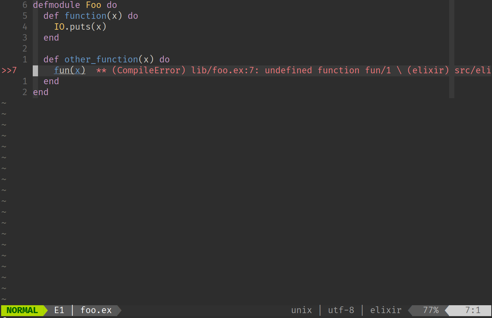
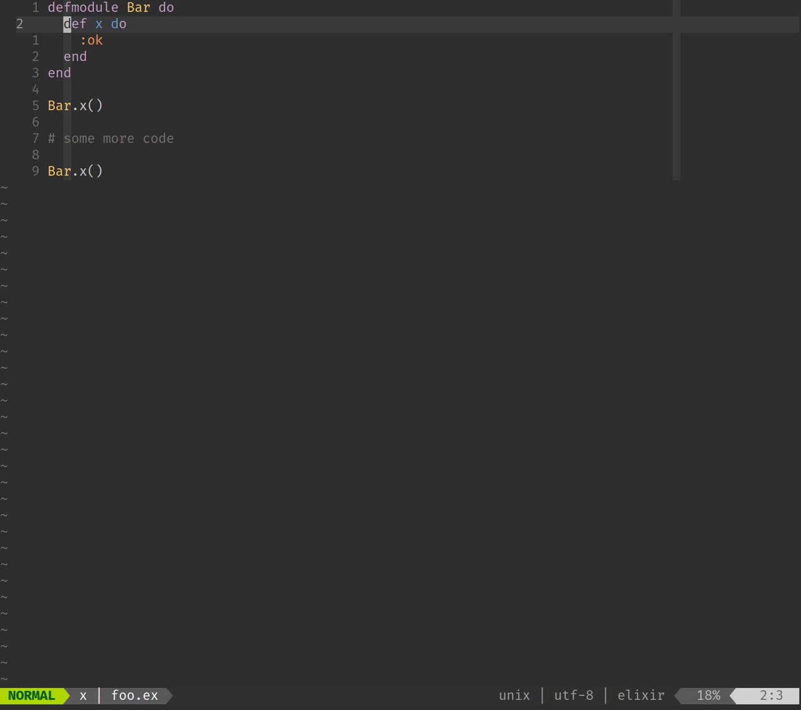
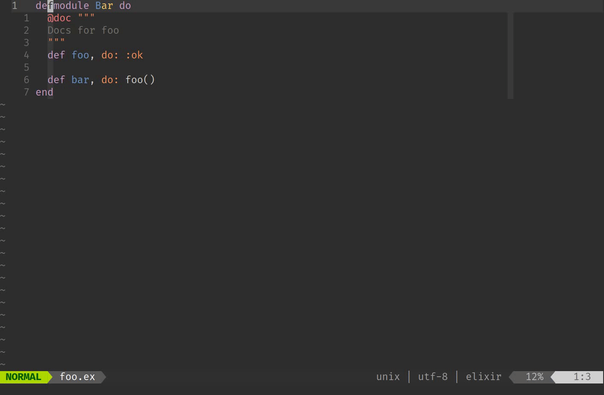
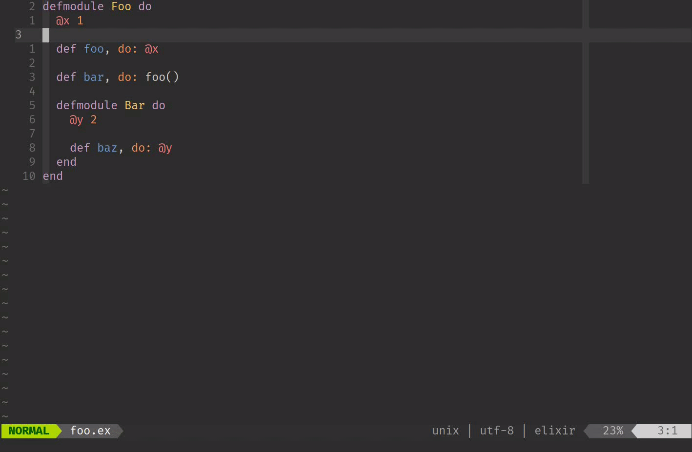
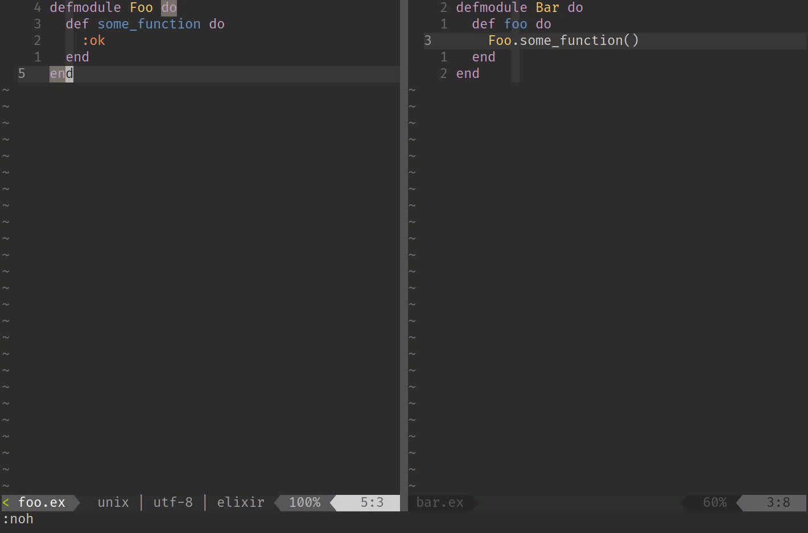
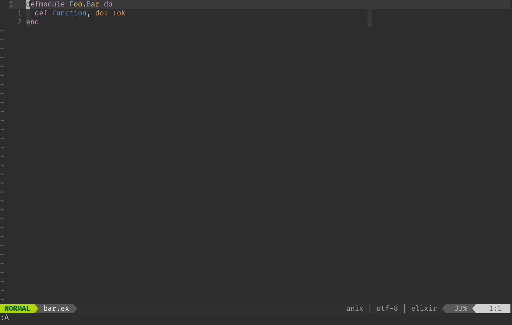
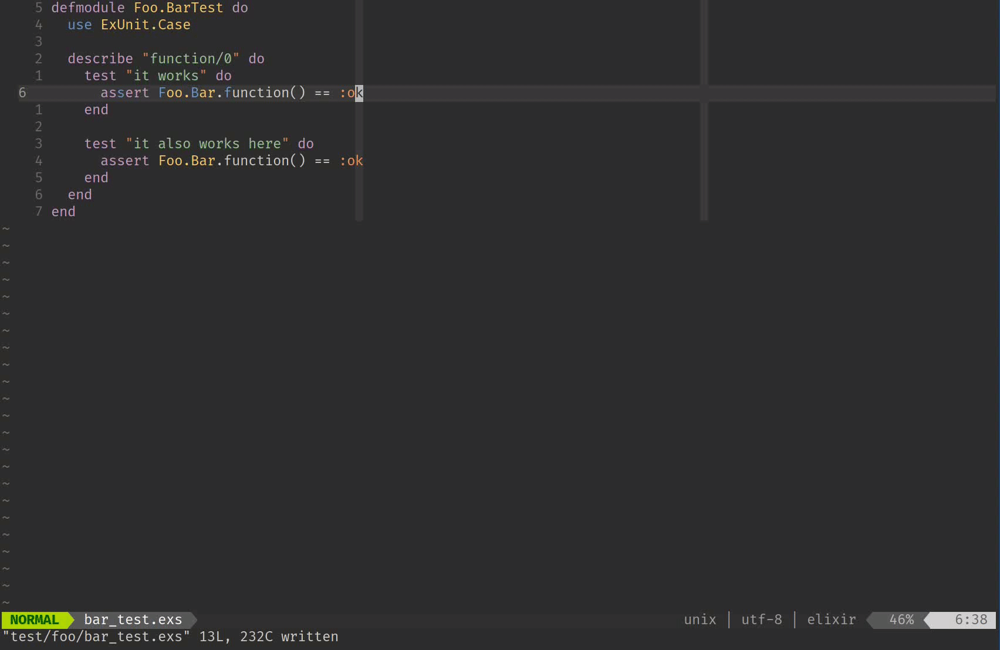

[last-post]: https://subvisual.com/blog/posts/133-super-powered-vim-part-i-projections/
[vscode]: https://code.visualstudio.com/
[atom]: https://atom.io/
[lsp]: https://microsoft.github.io/language-server-protocol/
[elixir]: https://elixir-lang.org/
[formatter]: https://hexdocs.pm/mix/1.6.0/Mix.Tasks.Format.html
[vim-ale]: https://github.com/dense-analysis/ale
[elixir_ls]: https://github.com/elixir-lsp/elixir-ls
[quickfix-reflector]: https://github.com/stefandtw/quickfix-reflector.vim
[vim-projectionist]: https://github.com/tpope/vim-projectionist
[vim-test]: https://github.com/vim-test/vim-test
[super-powered-vim]: https://subvisual.com/blog/posts/133-super-powered-vim-part-i-projections/
[dialixir]: https://github.com/jeremyjh/dialyxir
[coc-help]: https://github.com/neoclide/coc.nvim/blob/master/doc/coc.txt#L912
[twitter]: https://twitter.com/naps62
[dotfiles]: https://github.com/naps62/dotfiles

I would like to talk about how to turn vim into an IDE, with some special focus
towards [Elixir][elixir], which is the language of choice at Subvisual.

This post is a series of tips on plugins / configs to use in order to make your
development experience a lot more enjoyable.

## Wait... do I really need Vim?

**No.**

I'm the first one to recommend people not to learn how to use Vim, which
requires learning a lot of new habits and concepts upfront. Modern editors such
as [Atom][atom] and [VS Code][vscode] are just as good, even better, at least
regarding the learning curve.

There are very interesting and productive ideas behind Vim's way of doing
things, though.  So, if don't use Vim, hopefully you can at least find some of
these interesting, and incorporate them into your own workflow by finding the
equivalent approach on your editor.

Let's get to it, then...

## Don't worry about formatting

Because the editor should do it for you!

This is something modern languages have improved a lot on recently.  Code
readability is a must. But instead of checking linter warnings all the time to
find that annoying whitespace that was missing, or following the rules set by
our project, we should just focus on what matters, and let the rules enforce
themselves!

Elixir's [formatter][formatter], introduced in version 1.6, is a must-have now.
Running `mix format` on a project will automatically edit all our files
according to the code styleguide defined. And most of that styleguide is
standard for Elixir as a whole, making the configuration itself extremely
minimal. Here's the formatting config taken from [fsmx][fsmx], one of my
packages:

```elixir
[
  import_deps: [:ecto, :ecto_sql],
  inputs: ["{mix,.formatter}.exs", "{config,lib,test}/**/*.{ex,exs}"]
]
```

It does two things only:
1. lists what files to apply the rules to;
2. imports custom rules for Ecto functions (mostly about skipping parenthesis on
   Ecto's DSL)

Running `mix format` under this project will automatically format any
ugly-looking code. But you can go one step further and let your editor do it for
you:

```vimscript
Plug 'dense-analysis/ale'

let g:ale_fixers = { 'elixir': ['mix_format'] }
```

[`vim-ale`][vim-ale] is a linting engine for vim with autofixing capabilities.
It integrates with linters for pretty much every programming language. Here
we're configuring it to use the `mix_format` fixer, which runs `mix format` on
the current buffer whenever it is saved. Here it is happening in real time:



## Language Server

Language Servers are all the rage nowadays.  They provide a common API for
editors to understand each language's particularities, without having to resort
to ad-hoc plugins that are never without their flaws.

Language servers power tools such as the usual autocomplete list, "jump to
defintion" and "find ocurrences" that Java and other OO-programmers are used to,
but in a more systematic and language-agnostic way.

The language server implementation for Elixir is [`elixir_ls`][elixir_ls] and
for Vim can be integrated with [`coc.nvim`], the go-to language server client:

```vimscript
Plug 'neoclide/coc.nvim', { 'branch': 'release' }
Plug 'amiralies/coc-elixir', {'do': 'yarn install && yarn prepack'}
```

This gives you several new superpowers:

### 1. Inline dyalizer warnings

[Dialyzer][dialixir], a static analysis tool for Erlang/Elixir is, by itself,
a very useful but cumbersome tool to use.  It often takes too long to run, and
ends up relegated to being that tool you only run every couple of weeks, only to
find out you've been piling up on those warnings from the type system.

Having your editor run it for you in the background, and allowing you to have
near-instant feedback, makes the entire process much better.


 <div style="margin-top: 5em"></div>

### 2. Semantic code navigation

```vimscript
nmap <silent> gd <Plug>(coc-definition)
nmap <silent> gr <Plug>(coc-references)
```

Shortcuts such as this (and many more which you can check on the [help
page][coc-help]) provides quick contextual navigation within Elixir functions.

 <div style="margin-top: 5em"></div>

### 3. View documentation on the fly

```vimscript
nnoremap <silent> K :call <SID>show_documentation()<CR>
```


<div style="margin-top: 5em"></div>

### 4. View an outline of current file

```vimscript
nnoremap <silent> <leader>co  :<C-u>CocList outline<CR>
```


<div style="margin-top: 5em"></div>

## Project-wide Find/Replace

I've been searching for a good find & replace solution for Vim for a long time.
(dare I say, I've been finding & replacing them all this time?)

Recently, I found my perfect one so far, in the form of a very simple and hacky
trick: [quickfix-reflector][quickfix-reflector].

The quickfix window is a special non-editable buffer, usually used display
things like log messages or compiler errors.  It can also be used to show search
results, such as when calling `:Rg some_function` to find all ocurrences of
`some_function` in a codebase.

quickfix-reflector does the simple magic of making this quickfix window
editable, and then reverse-finding the locations of each original search result,
and update them. So find & replace operations become easy & powerful.  I love
especially the fact that the replacement query doesn't necessarily have to be
tied to the original search. It just ends up being applied on the lines that
were found. Such as in this example, where I'm searching for `some_function`,
but then changing only the `function` portion:



## Alternating through files

If you're doing some form of Test Driven Development, you likely have an
alternate test file for most of your Elixir files. A `lib/foo/bar.ex` will have
a corresponding `test/foo/bar_test.exs` counterpart.

Navigating between the two is a pattern that often comes up. You might want to
switch from implementation to tests, or back. Or open tests in a side pane to
work on both in parallel.

That's all possible, and configurable, with
[`vim-projectionist`][vim-projectionist].

I won't get into too much detail about it, because I already have another blog
post [on this exact subject][super-powered-vim], but here's a picture's worth
1000 words



## Running tests

Not being able to run tests quickly is one of the things that frustrates me the
most, and which I try to push people to improve on. Not only because I'm
a productivity freak, but because Test Driven Development is all about a fast
feedback loop.  If you take too long to trigger your test suite and get results
back, not only are you going to do less of that, you will also tend to write
less tests in the first place.

I go for the opposite. Not blindly reaching 100% coverage, but carefully looking
out for missing edge cases and untested flows.

For that, `vim-test` is invaluable, since it allows me to run tests with
a couple of keystrokes. Let's go through what a less ideal flow looks like for
running tests:

1. Saving the file
2. Cmd-tab (or some other kind of context switch) to a terminal window
3. `mix test test/my/test/file.ex:30`
4. Go back to the code

Using [`vim-test`][vim-test], that can all be condensed to a couple of
keystrokes, and no context switching at all:

```vimscript
Plug 'vim-test/vim-test'

" this part is optional, but I prefer using neoterm as the vim-test runner
Plug 'kassio/neoterm'
let test#strategy = "neoterm"
```



Seriously, how much more efficient is that compared to the manual approach?

## Wrapping up

This is an overview of some of the things I use on a daily basis to improve my
productivity.  Even if you don't use Vim, perhaps you can bring some new ideas
onto your own flow as well, or even implement similar plugins for your editor,
if they don't exist already.

Feel free to poke around my [dotfiles][dotfiles] if you're interested in seeing
more about of Vim setup. And let me know on [Twitter][twitter] if you have any
questions, or better yet, any new tips I can use. 👋🏽
