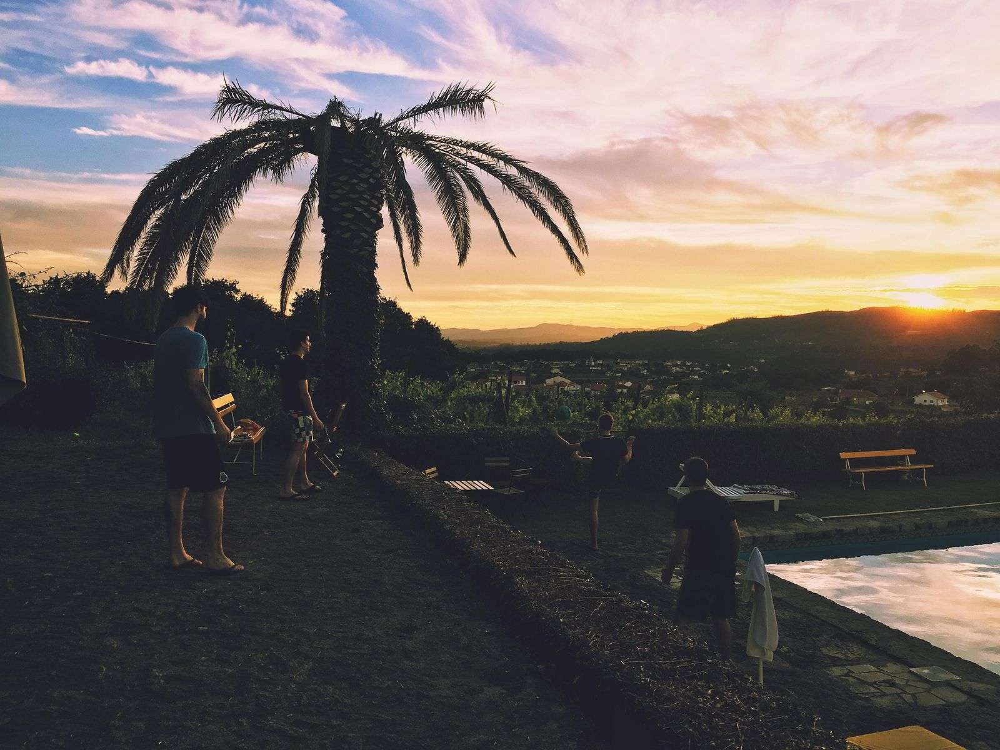

Summer is officially here and with it come longer days, warmer weather and
overall more things to do. Summer is always a good time to take some days off,
but this year this has become more important than ever.  Why so? 

This past year has been difficult for a lot of people everywhere due to obvious
reasons. We've never spent more time at home, but at the same time, we've never
been this mentally drained. In fact, the [New York Times wrote a very
interesting article][languishing] about the way most of us are feeling, naming this lack of
motivation and focus — languishing.  Resting properly is sometimes underrated
by many and being stuck at home led to people over-working for some months. 

**Now that things are slowly getting back to normal and the world is opening up
again, we decided to take action by implementing 4 day weeks in July and
August.**

We are very lucky to have a pretty relaxed work environment, without strict
schedules and where everyone can take days as needed, however this has been a
very difficult year for our mental health, so we knew we had to do better.

To make this decision, we first looked inwards. We realised that many of us
were feeling tired and discussed how we could make this better for everyone. We
brainstormed different possible measures and decided that this was the one that
suited us the best. Afterwards, we took this to our partners and clients to
make sure they were onboard and knew that we would be off on Fridays.

During these two months, our team will be able to rest and disconnect from work
for an extra day every week, hopefully allowing us to gain back some of the
time we've lost during 2020 and 2021.

## What to do when you're supposed to be doing nothing

Now that we'll have an extra day to rest and that most of our team will be
going on vacation, we are thinking of things to do and tips that may help you
unwind completely. Here's some of the things we came up to that you can also
try: 

* _Take in the sun:_ For Pedro nothing says resting like spending a day in the
  sun drinking a nice cocktail. What's your drink of choice? 
* _Avoid busy places:_ If you value peace and quiet like Miguel, staying away
  from overly popular places can be helpful. 
* _Explore Nature:_ Some of us, like Mirha for example, are planning on going
  out to nature and enjoying it as much as possible. How about going surfing or
  hiking? 
* _Stay away from technology:_ Alex will try to avoid the urge to be online all
  the time and take in his surroundings. Would you be down for leaving your
  phone at home for a day? 
* _Create memories:_ Laura will be taking this time to be more present in the
  moment and creating memories. You can try to do the same and be mindful of
  your time.
* _Read, watch & listen:_ some of our team's recommendations for books, shows
  and podcasts include [The Complete Persepolis], [The Foundation Trilogy], [V
  for Vendetta] and [Dune].

## Vacation Checklist

Lastly, we know how stressful going away can be, so we wrote down some steps
that can help you feel assured that everything will run smoothly in your
absence. 

* Appoint a person of contact: let the team know who they can talk to if they
  need something that is usually taken care of by you; 
* Organize your tasks: is there any work that must be done before you head out?
  Try doing these tasks before leaving. If you don't have enough time:
  * can those tasks wait until you come back? Don't stress about them, you'll
    tackle those when your back;  
  * these tasks cannot wait or be postponed? Write a to-do list and the needed
    info to complete them so your team knows what needs to be done;
* Setup email on vacation mode: configure your email to notify those who
  contact you that you're on vacation. This will not only give you peace of
  mind, as it will also provide your contacts with the information that you may
  take longer to reply, or who to contact if it's an urgent matter; 
* Turn-off work notifications: avoid the urge of checking your work email and
  chat by turning all notifications off; 

The most important step though is to make sure you book your days-off without
feeling guilty. Sure, there will always be something to be done, a deadline to
meet and extra tasks that you could be doing, but taking time for yourself is
just as important. 

Now that we have our time-off well-organised, it's time to get back to work and
get ready for this year's [Summer Camp].

**Summer Campers will form a team and build a product together to solve a
pre-defined problem. If you're looking into a career in programming, design or
product management, this is the perfect opportunity to get a taste of what it's
like to work on a team and build a product from scratch.**

We wish you a great rest and we'll be back soon with another edition of
Submonthly.

_PS: We're hiring! If you're interested or you know someone who might be, check
out our career opportunities [here](https://jobs.subvisual.com/)._

[languishing]: https://www.nytimes.com/2021/04/19/well/mind/covid-mental-health-languishing.html
[The Complete Persepolis]: https://www.goodreads.com/book/show/991197.The_Complete_Persepolis
[The Foundation Trilogy]: https://www.goodreads.com/book/show/46654.The_Foundation_Trilogy
[V for Vendetta]: https://www.goodreads.com/book/show/5805.V_for_Vendetta
[Dune]: https://www.goodreads.com/book/show/44767458-dune
[Summer Camp]: https://jobs.subvisual.com/summer-camp-program/en
